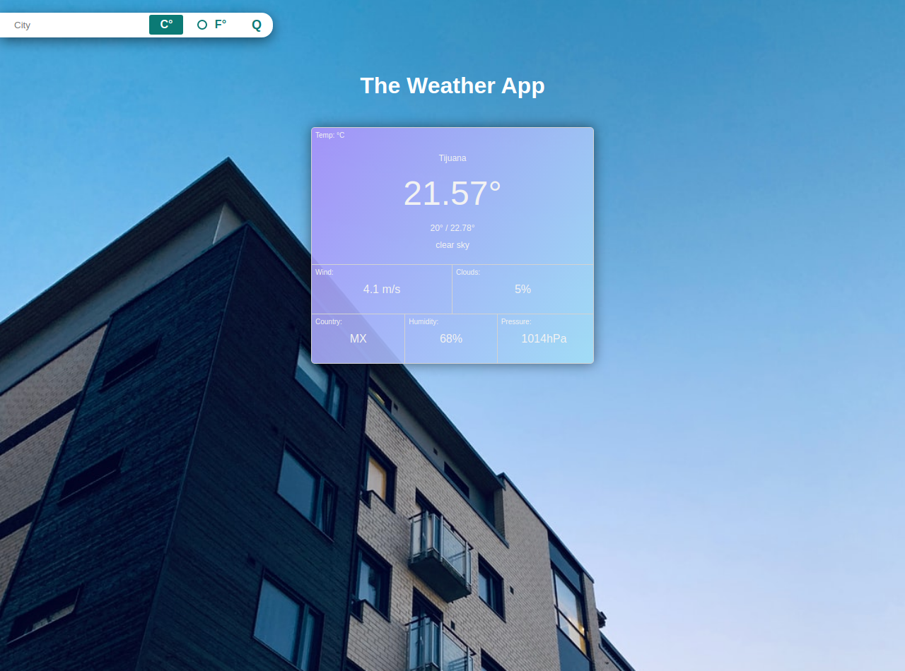

# The Weather App

> The Weather App project comes at the end of the Asynchronous Javascript and APIs
> section of the Javascript course. It is intended for tests the knowledge of the student about
> asynchronous communication with promises or async/await and when to use them.

You can find the original requirements at [The Odin Project](https://www.theodinproject.com/courses/javascript/lessons/weather-app) 

## Built With

- JavaScript, HTML, CSS
- Webpack, Sass

## Live Demo

[Live Demo Link](https://rawcdn.githack.com/oscardelalanza/the-weather-app/69f5652358031c37b246e14f9720f65c69709a8e/dist/index.html)

## Getting Started

This project consist of an application to check the weather of any city in the world. It makes an `Http` request to the 
`OpenWeather API` in order to get the current weather conditions of the desired city. Also it makes a request to the `Unsplash API`
in order to get a random image depending on the weather conditions of the requested city and placed as background.

#### Search bar

In order to get the current weather of any city in the world, fill the `input` with the name of the city in the search bar
choose the desired metric system by clicking the `C°` or the `F°` units, then click the `Q` button to make the request.

#### result div

Once you click the `Q` button, it will fill the central `div` with the weather information of the requested city. It shows
information like `temperature`, `wind`, `clouds`, `humidity`, `pressure`, `country` and so on.

> To get a local copy up and running follow these simple example steps.
 
### Prerequisites

- `npm`
- `git`

### Setup

To clone the project into your local environment do the following

- open a new `terminal` window and navigate to the directory where the project will be stored
- run the command `git clone git@github.com:oscardelalanza/the-weather-app.git`
- run the command `cd the-weather-app` to enter to the project directory

### Install

To install the requires packages do the following

- inside `the-weather-app` directory run the command `npm install`

### Usage

To start the local development server do the following

- run the command `npm run dev` 

### Run tests

- no written tests yet

### Deployment

To build the project do the following

- run the command `npm run build`

## Authors

👤 **Oscar De La Lanza**

- Github: [@oscardelalanza](https://github.com/oscardelalanza)
- Twitter: [@twitterhandle](https://twitter.com/oscardelalanza)
- Linkedin: [Oscar De La Lanza](https://linkedin.com/in/oscardelalanza/)
- Email: oscardelalanza@gmail.com

## 🤝 Contributing

Contributions, issues and feature requests are welcome!

Feel free to check the [issues page](issues/).

## Show your support

Give a ⭐️ if you like this project!
